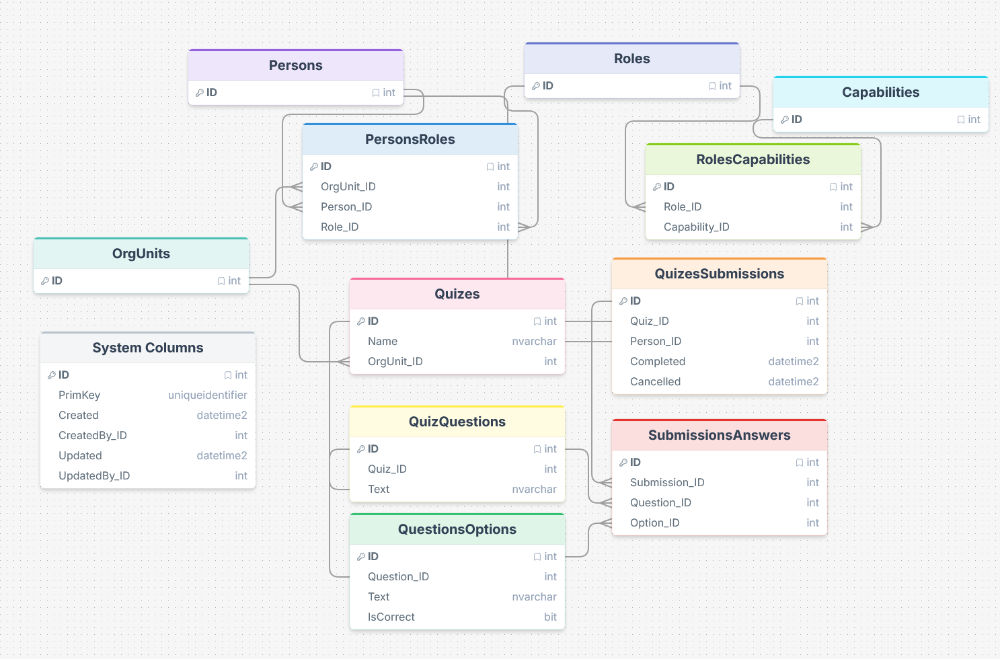

# Fagprøve plan
07/04/2026 - 15/04/2026

## Mål med oppgaven
Applikasjonen skal la elever gjennomføre quizer med flervalgsspørsmål, mens lærere kan administrere innhold og følge med på resultater.

## Krav til oppgaven

### Nødvendige krav
- Elev må kunne
  - Gjennomføre quiz med flervalgsspørsmål
  - Få umiddelbar tilbakemelding på om svaret er riktig eller feil per spørsmål
  - Se total poengsum ved slutten av quizen
  - Starte quizen på nytt med ett klikk
- Lærer må kunne
  - Opprette og administrere quizer per OrgUnit
  - Legge til og fjerne spørsmål med svaralternativer
  - Se elevenes resultater per quiz
- System må ha
  - Klient-applikasjon for quiz-gjennomføring og admin
    - Vue frontend
  - Server-side for databehandling
    - SQL database
  - Sikret API for integrasjon
    - Omega sitt Data API
  - Tilgjengelig og brukervennlig design for alle brukergrupper
    - Personvern
      - Lagre minst mulig data
      - Tilgangsstyring - elever ser kun egne resultater
    - Dataintegritet
      - Svar lagres per spørsmål via prosedyre - ikke i bulk ved slutten
      - Forhindrer juks ved at fasit aldri eksponeres til frontend før man svarer
    - Responsivt design
      - Støtte både mobil og datamaskin

### Avklaringer/antakelser
- Innlogging
  - Alle brukere (elever og lærere) har eksisterende Omega-brukere
  - Lærere identifiseres via en egen rolle/modul i Omega CTP
  - Elever uten lærerrolle har ikke tilgang til adminpanelet
- Quizlogikk
  - Spørsmålsrekkefølge shuffles per sesjon for variasjon
  - Quizer er knyttet til en OrgUnit, slik at f.eks. en klasse kun ser sine egne quizer
  - Poengsum lagres ikke eksplisitt, skal beregnes i view ved å joine SubmissionsAnswers mot QuestionsOptions og selecte ut IsCorrect
  - Svar sendes inn ett om gangen via prosedyre som returnerer om svaret var riktig eller feil - frontend bruker dette til å vise tilbakemelding uten å kjenne fasiten på forhånd
- Resultater
  - Elever ser kun sine egne innleveringer
  - Lærere ser alle elevers resultater med navn og tidspunkt

### Nice-to-have (kan gjøres om jeg finner ut at jeg har bedre tid enn forventet)
- Tidsbegrensning per quiz
- Statistikkvisning for lærere (gjennomsnitt, spredning per spørsmål)
- Tilfeldig utvalg av N spørsmål fra en større pool

## Teknologivalg
- Omega 365 CTP (Core Technology Platform) på grunn av innebygd Data API og tilgangsstyring. Dette er rammeverket som brukes i bedriften
  - Vue 3
    - Klient-siden av programmet
    - Gjør struktur av koden enkel pga. komponentbasert kode
  - Bootstrap 5
    - Brukes i Vue-koden for å lage layouts og responsivt design for alle brukergrupper (mobil/datamaskin)
  - Microsoft SQL Server
    - Server-siden av programmet for databehandling
    - Nødvendig for å lagre spørsmål, svar og resultater med dataintegritet
  - Data API
    - Enkel og sikker integrasjon mellom server-siden og klient-siden
    - Utviklet av Omega
    - Trygt mot SQL injection
- Github
  - Dokumentasjon
  - Planlegging
  - Loggføring
- DrawSQL
  - Skisser for datamodell

## Fremgangsmåte
- Planlegge datamodell og app-layout
- Lage roller og moduler for tilganger til systemet
- Lage SQL-templates for å sikre konsistente tilgangssjekker på tvers av alle objekter
  - Omega 365 CTP støtter templates for triggere og views som automatisk genererer standard sikkerhetssjekker
  - Dette sikrer at alle tabeller får lik struktur på tilgangskontroll, og reduserer risikoen for å glemme sikkerhet på nye objekter
  - Gjør det også enklere å vedlikeholde siden sikkerhetslogikken ligger ett sted
- Lage SQL-objekter
  - Tabeller
    - Alle egendefinerte tabeller får Omega sine standard systemkolonner automatisk:
      - `PrimKey` (uniqueidentifier) - unik GUID-nøkkel brukt eksternt
      - `Created` / `CreatedBy_ID` - sporbarhet på opprettelse
      - `Updated` / `UpdatedBy_ID` - sporbarhet på forrige endring
    - Quizes
      - Inneholder `Name` og `OrgUnit_ID` for å knytte quizen til en klasse/enhet
      - U/I/D-Trig: standard tilgangssjekk - kun lærere kan opprette og endre
    - QuizesQuestions
      - Kobler spørsmål til en quiz via `Quiz_ID`
      - U/I/D-Trig: standard tilgangssjekk - kun lærere kan endre
    - QuestionsOptions
      - Svaralternativer per spørsmål med `IsCorrect`-flagg
      - `IsCorrect` eksponeres aldri direkte til elev-apper - kun lest server-side i prosedyre
      - U/I/D-Trig: standard tilgangssjekk - kun lærere kan endre
    - QuizesSubmissions
      - Opprettes når en elev starter en quiz, med `Person_ID` og `Quiz_ID`
      - `Completed` settes når alle spørsmål er besvart, `Cancelled` om eleven avbryter
      - ITrig: sett `Person_ID` fra innlogget bruker
      - U/D-Trig: blokkert for elever - kun systemet kan sette Completed/Cancelled
    - SubmissionsAnswers
      - En rad per besvart spørsmål med `Submission_ID`, `Question_ID` og `Option_ID`
      - U/D-Trig: blokkert - svar kan ikke endres etter innsending
      - I-Trig: standard tilgangssjekk + sjekk på om `CreatedBy_ID` er den som inserter, sånn at folk ikke kan svare andre sine submissions
  - Views
    - aviw_QuizesQuestionsWithOptions
      - Joiner QuizesQuestions og QuestionsOptions - brukes av quiz-player til å hente spørsmål med alternativer (uten IsCorrect)
    - aviw_SubmissionsResults
      - Joiner QuizesSubmissions med Persons og beregner poengsum ved å joine SubmissionsAnswers mot QuestionsOptions på IsCorrect - brukes i lærerens resultatoversikt
  - Prosedyrer
    - astp_StartQuiz
      - Tar imot `Quiz_ID`
      - Lager rad i Submissions
      - Returnerer `SELECT Submission_ID` fra raden som nettop ble opprettet
      - Frontend bruker returverdien til å sende inn svarene på rett submission
    - astp_SubmitAnswer
      - Tar imot `Submission_ID`, `Question_ID` og `Option_ID`
      - Lagrer rad i SubmissionsAnswers
      - Returnerer `SELECT IsCorrect` fra QuestionsOptions
      - Frontend bruker returverdien til å vise riktig/feil - fasiten forlater aldri databasen som en del av en vanlig spørring
- Lage layouts for apper i Vue
- Legge til funksjoner i appene
  - quiz-player: spørsmålsvisning, kall til astp_SubmitAnswer per svar, tilbakemelding, poengsumvisning, restart
  - quiz-admin: administrasjon av quizer og spørsmål, resultatoversikt via aviw_SubmissionsResults
- Teste + bugfixing
- Vurdere om jeg har tid til ekstrafunksjonalitet + eventuell innføring
- Skrive systemdokumentasjon, testrapporter og brukerveiledninger underveis

## Skisser
### Datamodell

- **System Columns** - standard kolonner som Omega 365 CTP oppretter automatisk i alle egendefinerte tabeller: `PrimKey` (unik GUID), `Created`, `CreatedBy_ID`, `Updated`, `UpdatedBy_ID`.
- **OrgUnits / Persons / Roles / Capabilities / PersonsRoles / RolesCapabilities** - Omega sine systemtabeller for organisasjonsstruktur og tilgangsstyring. Disse eksisterer fra før og berøres ikke av løsningen, men brukes aktivt: `OrgUnit_ID` på Quizes knytter en quiz til en klasse, og rollene styrer hvem som er lærer vs. elev. Capablities blir lagt på rollene for å sette hvem som kan redigere quizer, og hvem som kan svare. Lærer rollen vil da f.eks. ha capabilities for å redigere, se andre sine svar, og svare selv, mens elev bare skal kunne svare.
- **Quizes** - hovedtabell for quizer, knyttet til en OrgUnit
- **QuizesQuestions** - spørsmål tilhørende en quiz
- **QuestionsOptions** - svaralternativer per spørsmål med `IsCorrect`-flagg (leses kun server-side)
- **QuizesSubmissions** - en rad per elev per quiz-gjennomføring, med `Completed` og `Cancelled` for å spore status
- **SubmissionsAnswers** - detaljlogg av hvert svar en elev har gitt, brukes til å beregne poengsum i view

### Forklaring av brukergrensesnitt
**Quiz-spiller app (elev)**
- Velkomstskjerm -> velg quiz -> Start-knapp
- Spørsmålsvisning: ett spørsmål om gangen med svaralternativer
- Svar sendes til astp_SubmitAnswer som returnerer riktig/feil
    - Highlight av svaret de valgte i enten rødt eller grønt
- Resultatskjerm: poengsum beregnet fra SubmissionsAnswers + Prøv igjen-knapp

**Quiz-admin app (lærer)**
- Quizoversikt per OrgUnit med opprett/slett
- Spørsmålsadministrasjon per quiz: legg til/fjern spørsmål og alternativer
- Resultatoversikt: tabell med elevnavn, poengsum, dato

## Tidsskjema
- Tirsdag (dag 1)
  - Gjennomgang av fagprøve og krav (1t)
  - Skrive plandokument og lage skisser (4t)
  - Begynne på oppsett av moduler og roller (2t)
  - Levere planlegging (0,25t)
  - Logging (0,25t)
- Onsdag (dag 2)
  - Opprette SQL-tabeller, views og triggere (3t)
  - Legge inn testdata (0,5t)
  - Begynne på quiz-player layout (3,5t)
  - Logging (0,25t)
- Torsdag (dag 3)
  - Motta og planlegge endringsoppgave (1,5t)
  - Fullføre quiz-player logikk og poengsumvisning (5,5t)
  - Logging (0,25t)
- Fredag (dag 4)
  - Implementere endringsoppgave (3t)
  - Starte quiz-admin app (4t)
  - Logging (0,25t)
- Mandag (dag 5)
  - Fullføre quiz-admin (3t)
  - Testing og bugfixing (3t)
  - Begynne systemdokumentasjon (1,5t)
  - Logging (0,25t)
- Tirsdag (dag 6)
  - Fullføre systemdokumentasjon, testrapport og brukerveiledning (4t)
  - Finpusse kode og UI (2,5t)
  - Levere dokumentasjon 17:00 (0,25t)
  - Logging (0,25t)
- Onsdag (dag 7)
  - Forberede og gjennomføre presentasjon (09:00)
  - Egenvurdering

## Programvare og ressurser
- Omega 365 CTP: utviklingsmiljø, tilgjengelig via bedriften
- Visual Studio Code: skrive plandokumenter og dokumentasjon
- GitHub: lagring av dokumentasjon og plan
- DrawSQL: datamodell-skisser

## Kostnadsoverslag
- Arbeidstid: 52.5 timer * 225 kr (timekost lærling) = 11 812,50 kr
- Hostingkostnader: 10 000 kr

## Avgrensninger og forbehold
- Alle brukere forutsettes å ha eksisterende Omega-brukere
- Det er satt av tid til endringsoppgave dag 3-4, men konkret implementasjon avhenger av hva endringen innebærer

## Kilder
- [Claude AI](https://claude.ai)
- Faglig leder / kollegaer
- [Tidligere fagprøvemateriale (github)](https://github.com)